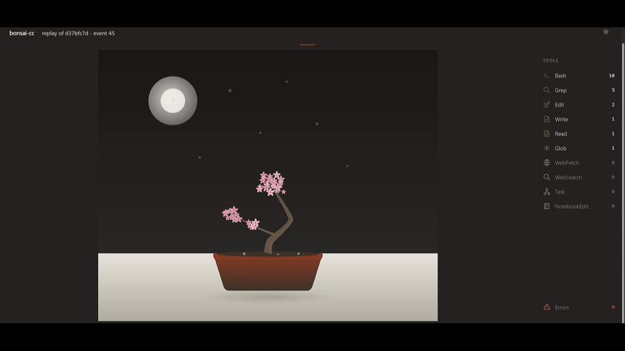
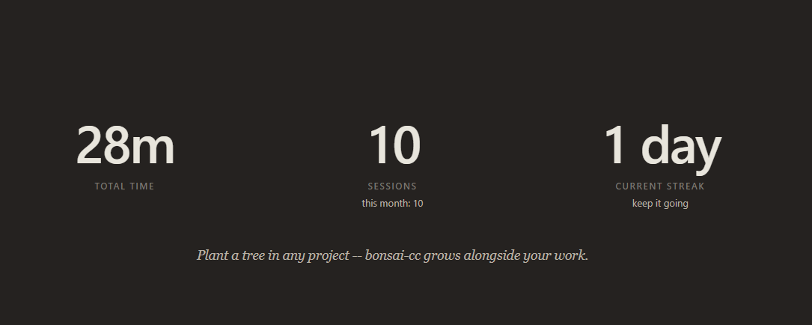
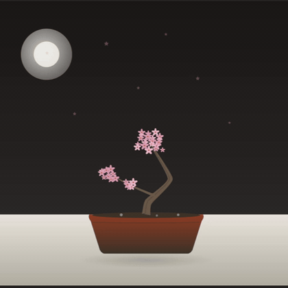
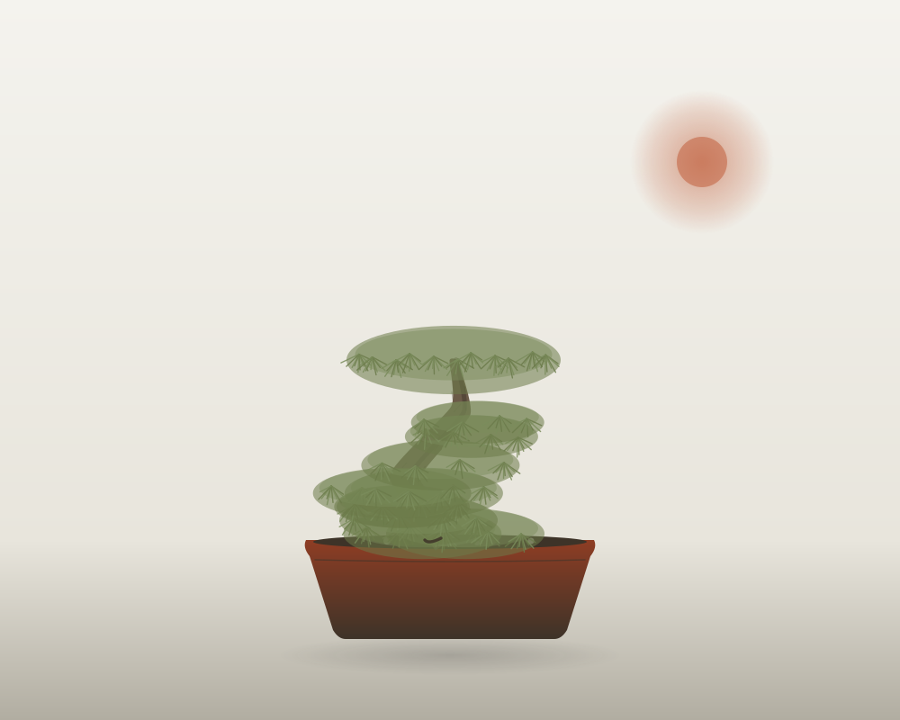
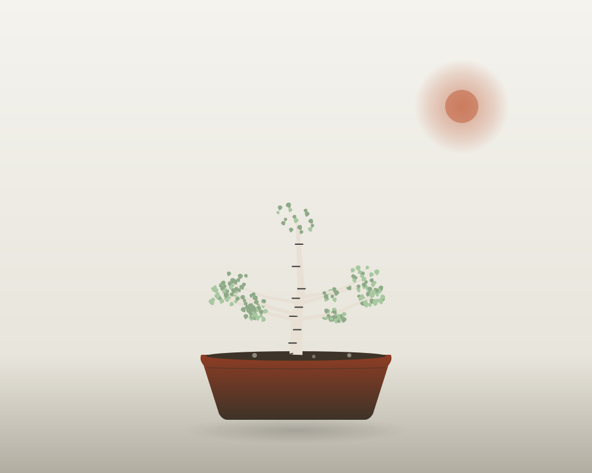
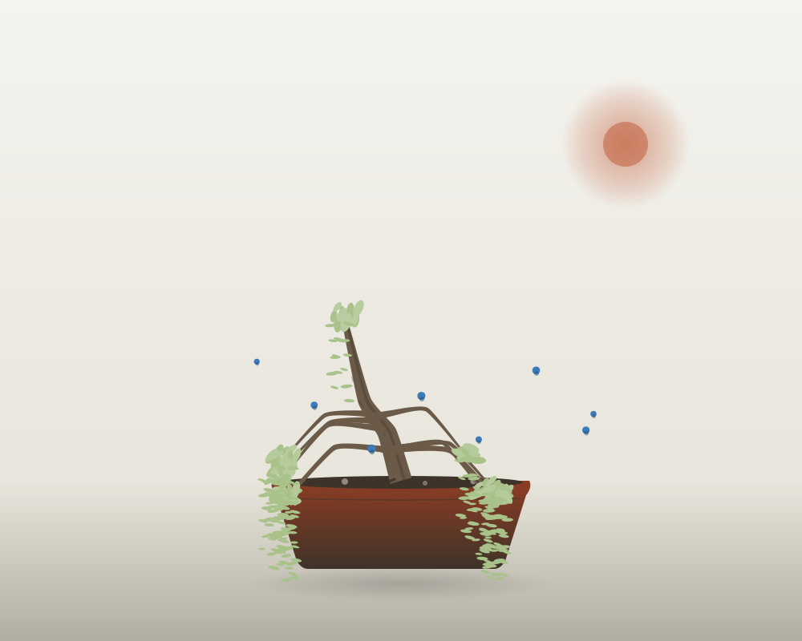

# bonsai-cc

<p align="center">
  <strong>A living bonsai that grows in your browser during Claude Code sessions.</strong>
</p>

<p align="center">
  Every tool call shapes the tree. Bash commands grow roots, file edits grow
  branches, reads add leaves, web fetches bloom into flowers, sub-agents spawn
  offshoots. When the session ends the tree is saved to your local garden and
  can replay bit-for-bit from its event log.
</p>

<p align="center">
  <a href="https://github.com/davvikq/bonsai-cc/releases"></a>
  <a href="LICENSE"></a>
  <a href="https://www.python.org/downloads/"></a>
  <a href="#"></a>
  <a href="https://github.com/davvikq/bonsai-cc/stargazers"></a>
</p>

<p align="center">
  
</p>

---

## Why bonsai-cc

You've just finished a Claude Code session. What did the agent actually do? A
glance at the transcript answers it eventually; a single picture answers it
in one second.

**bonsai-cc turns each session into a tree.** The shape of that tree is a
visual map of the work — thick trunk for long sessions, lots of branches for
many files touched, flowers for web research, wilted leaves where things
broke. You see at a glance what got done.

The renderer is a local web view (one inline-SVG page, no CDN, no bundler, no
framework). Twelve language themes pick the silhouette automatically: bamboo
for Python, pine for Rust, willow for JavaScript, sakura for Swift, and so on.
Sessions persist in a local SQLite garden you can browse and replay later.

> **Not to be confused with `code-bonsai`** (VuKhoiGVM/code-bonsai), which
> draws a one-shot bonsai from static git metrics like LOC and branch count.
> That tool shows *what your repo is*. **bonsai-cc shows *what your session
> was*.**

---

## How it works

```
  Claude Code hook                    ~/.bonsai-cc/journals/<sid>.jsonl
   ───────────┐                                       ▲
              │  stdin: JSON                          │ fsync, atomic append
              ▼                                       │
   bonsai-cc-hook ──────────────────────────────────► │
   stdlib only, <500ms, fail-silent                   │
                                                      │
                            ╔═════════════════════════╧════════════════╗
                            ║       daemon (optional, run as needed)   ║
                            ╠══════════════════════════════════════════╣
                            ║ watchfiles tail-reader                   ║
                            ║   │ new line → parse → publish to bus    ║
                            ║   ▼                                      ║
                            ║ apply_event (pure, deterministic)        ║
                            ║   │                                      ║
                            ║   ▼                                      ║
                            ║ aiohttp + SSE → browser SVG (live)       ║
                            ║   │                                      ║
                            ║   ▼ on SessionEnd or idle-timeout        ║
                            ║ garden.db (SQLite) + thumbnail SVG       ║
                            ╚══════════════════════════════════════════╝
```

Two properties of this shape:

1. **The hook never depends on the daemon.** It writes the journal line and
   exits in <500 ms. If you never launch `bonsai-cc`, the journals still sit
   on disk awaiting recovery.
2. **Daemon startup is just catch-up.** When you do launch `bonsai-cc`, the
   watcher scans existing journals, the runner replays them through
   `apply_event`, and the browser shows you the result — byte-identical to
   what the live session looked like.

---

## Quickstart

Requires **Python 3.11+** and **Claude Code**.

```bash
uv tool install bonsai-cc
bonsai-cc install-hook --global   # one-time, global

# now run claude as you normally would in any project:
claude

# whenever you want to see the garden:
bonsai-cc
```

That's it. The hook fires automatically on every Claude Code event; when you
launch `bonsai-cc` (no args) a browser tab opens with:

- a **live tree** at the top if a session is currently active, animating as
  events arrive;
- a **garden grid** below: every saved session as a card with thumbnail SVG,
  language tag, event count, age, and a one-click animated replay.

Need a smoke test before turning on a real session? Replay one of the shipped
fixtures:

```bash
bonsai-cc watch --replay tests/fixtures/events/mixed_tools.jsonl
```

---

## Preview

<table>
  <tr>
    <td width="40%" align="center"><strong>Garden hero: total time, sessions, streak</strong></td>
    <td width="60%" align="center"><strong>A bonsai growing in real time</strong></td>
  </tr>
  <tr>
    <td></td>
    <td></td>
  </tr>
</table>

---

## Twelve language themes

`bonsai-cc` detects the language at the project root and picks a themed
silhouette:

<p align="center">
  
  
  
  
</p>
<p align="center">
  
  
  
  
</p>
<p align="center">
  
  
  
  
</p>

| Theme       | Detected from                                                        | Silhouette                                              |
| ----------- | -------------------------------------------------------------------- | ------------------------------------------------------- |
| `python`    | `pyproject.toml`, `setup.py`, `requirements.txt`, `Pipfile`          | bamboo — four vertical stalks with horizontal nodes     |
| `rust`      | `Cargo.toml`                                                         | pine — gnarled trunk, flat-topped horizontal tiers      |
| `go`        | `go.mod`                                                             | oak — thick squat trunk, wide rounded canopy            |
| `typescript`| `tsconfig.json` or `package.json` mentioning `typescript`            | willow + small TS-blue fruits                           |
| `javascript`| `package.json` (no TS)                                               | willow — slanted trunk, drooping curtains               |
| `swift`     | `Package.swift`, `*.xcodeproj`, `*.xcworkspace`                      | sakura — bunjin literati trunk, cherry blossoms         |
| `ruby`      | `Gemfile`, `*.gemspec`                                               | maple — five-lobed leaves, fallen leaves on soil        |
| `c` / `cpp` | `CMakeLists.txt`, `meson.build`, `Makefile`, `*.vcxproj`             | old oak — very thick trunk with deadwood and knots      |
| `java`      | `pom.xml`, `build.gradle[.kts]`, `settings.gradle[.kts]`             | banyan — aerial roots descending to the soil            |
| `haskell`   | `*.cabal`, `stack.yaml`, `dune-project`, `elm.json`                  | ginkgo — golden fan-shaped leaves                       |
| `zig`       | `build.zig`, `build.zig.zon`                                         | birch — pale slender trunk with horizontal lenticels    |
| default     | nothing matched                                                      | generic — asymmetric S-curve, ellipse leaf clusters     |

Manifest detection runs first; if none match, a histogram over the top two
directory levels picks the dominant extension. Override with
`BONSAI_CC_FORCE_THEME=python` (or any theme name).

---

## Event → growth mapping

| Hook event                                          | Visual effect                                          |
| --------------------------------------------------- | ------------------------------------------------------ |
| `SessionStart`                                      | Plant the seed, detect language, pick palette          |
| `PostToolUse(Bash)`                                 | Grow a root cluster from `cwd`                         |
| `PostToolUse(Edit \| Write \| NotebookEdit)`        | Extend (or create) the branch for `file_path`          |
| `PostToolUse(Read)`                                 | Add a leaf to that file's branch                       |
| `PostToolUse(Glob \| Grep)`                         | Drop a 3-leaf cluster on the most-recent branch        |
| `PostToolUse(WebFetch \| WebSearch)`                | Bloom a flower at the canopy                           |
| `PostToolUse(Agent)` / `SubagentStart`              | Spawn a small offshoot from the trunk                  |
| `SubagentStop`                                      | Cap the offshoot with a • berry                        |
| `PostToolUseFailure`                                | Yellow the last leaf; a second failure drops it        |
| `PreCompact`                                        | Prune the oldest leaves (visual: small falling)        |
| `Notification`                                      | Wind ripple across the canopy                          |
| `SessionEnd`                                        | Freeze the tree and commit it to the garden            |

Time-of-day ambient layers ride on top: sun at noon, moon during night
sessions, dew at dawn, snowflakes after eight-hour marathons.

---

## Commands

```bash
bonsai-cc                       # open the web garden + live view (default)
bonsai-cc install-hook          # add hook (--project default; --global available)
bonsai-cc garden                # alias of the default (web garden)
bonsai-cc list                  # plain-text listing of saved sessions
bonsai-cc show <id-prefix>      # print final ASCII to stdout
bonsai-cc export <id> --format png -o tree.png
bonsai-cc replay <id>           # open one saved session in the browser
bonsai-cc doctor                # diagnose what's wired up
bonsai-cc uninstall-hook        # remove the hook cleanly
bonsai-cc --version             # print version and exit
```

Run any command with `--help` for the full flag list. `--port N` pins the web
server to a known port; `--no-browser` skips the auto-open (useful over SSH
with port-forwarding).

---

## Data & Privacy

`bonsai-cc` is **100% local** — no telemetry, no auto-update, no network
calls of any kind. But the hook records the **full Claude Code payload** to a
local journal so sessions can replay byte-identical. You should know what's
on disk.

**Where data lives**

| Path                                                                          | What it holds                                                                 |
| ----------------------------------------------------------------------------- | ----------------------------------------------------------------------------- |
| `~/.bonsai-cc/journals/<session_id>.jsonl` (POSIX) / `%LOCALAPPDATA%\bonsai-cc\journals\` (Windows) | One JSONL per session. Each line is the raw hook payload.                     |
| `~/.bonsai-cc/garden.db`                                                       | SQLite store: one row per saved session. Final ASCII + state JSON + thumbnail. |
| `~/.bonsai-cc/hook_client.py`                                                  | The verbatim hook script installed by `install-hook`. Stdlib-only. Auditable. |
| `~/.bonsai-cc/logs/`                                                           | Optional debug log (only when `BONSAI_CC_DEBUG=1`).                            |
| `~/.bonsai-cc/exports/`                                                        | Files written by `bonsai-cc export`.                                          |

**What the journal contains**

The raw hook payload from Claude Code, which includes:

- `prompt` text on every `UserPromptSubmit` event (what you typed).
- `tool_input` for every tool call — the literal command for `Bash`, the
  patch text (`old_string` / `new_string`) for `Edit`, the file content for
  `Write`, search patterns for `Grep`, the URL for `WebFetch`.
- `cwd`, `transcript_path`, `session_id`, model name.

Nothing leaves your machine. But the journal is plain JSON on disk —
backup software, cloud sync (Dropbox / iCloud / OneDrive following your
home), an antivirus that ships samples — will see it.

**Opt-in redaction: `BONSAI_CC_REDACT=1`**

```bash
export BONSAI_CC_REDACT=1     # POSIX
$env:BONSAI_CC_REDACT = "1"   # PowerShell
```

The hook blanks `prompt`, `old_string`, `new_string`, and `content` in every
record (replaced with `[redacted by BONSAI_CC_REDACT]`). Everything the
growth engine needs — `hook_event_name`, `tool_name`, `file_path`, `cwd` — is
preserved, so the rendered tree is byte-identical with or without redaction.
Off by default; the lossless mode is what makes deterministic replay
possible.

The HTTP server binds to `127.0.0.1` only and validates the `Host` header
against a loopback allowlist to defeat DNS rebinding.

---

## FAQ

**Does it slow down Claude Code?**
No. The hook is a small standalone Python script that uses only the standard
library, has a hard 500 ms wall-clock budget, and fails silently in every
error path (disk full → exit 0; bad JSON → exit 0; permission denied →
exit 0). On a modern dev machine the p99 cold-start is ~60 ms.

**Does Ctrl+C lose my tree?**
No. The hook writes the journal record with `fsync` *before* returning to
Claude Code. The daemon doesn't even need to be running: events accumulate
on disk, and the next time you launch `bonsai-cc` the watcher picks them up
and the garden saves them.

**What if my Claude Code version adds new hook events?**
Forward-compatible by design. Unknown events are journaled raw, logged at
WARN, and dropped from the growth pipeline. Once you update bonsai-cc,
replay the journal — your old session's tree comes back byte-identical.

**Can I use it with other AI agents (Aider, Cursor, Codex)?**
The hook ingestion layer is schema-validated by Pydantic and forward-
compatible; the growth engine takes any sequence of typed events. Adding an
adapter for another agent is a single new ingestion path — open an issue if
you want to try.

**Can I share my trees?**
Not in v1. The garden lives in your home directory; a `share` command is on
the roadmap but not imminent. You can already pipe `bonsai-cc show <id>` for
ASCII or `bonsai-cc export <id> --format png` for a screenshot.

**Why not just ASCII in the terminal?**
The live ASCII TUI shipped in v0.1 and was removed in v0.2 — animating
inside a terminal didn't carry enough information density, and a browser
canvas lets every theme have a real silhouette. `show` / `export --format
txt` still produce ASCII for piping and chat snippets.

---

## Tests

```bash
uv sync
uv run pytest                     # all 364 tests
uv run pytest -k determinism      # the load-bearing tests
uv run ruff check src tests       # lint
uv run mypy src/bonsai_cc         # type-check (strict)
```

---

## License

[MIT](LICENSE) — use it, fork it, ship it. © 2026 Davvik.

---

<p align="center">
  <a href="https://github.com/davvikq/bonsai-cc/releases">Releases</a> ·
  <a href="CHANGELOG.md">Changelog</a> ·
  <a href="https://github.com/davvikq/bonsai-cc/issues">Issues</a>
</p>

<p align="center">
  <em>The aesthetic owes everything to <a href="https://gitlab.com/jallbrit/cbonsai">cbonsai</a>.
  We don't borrow its code — we adopt its conclusions: age-based thickness,
  gravity, stochastic L-system, phototropism.</em>
</p>
